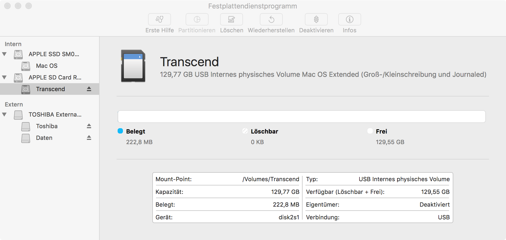

type=post
title=iTunes Bibliothek auf Transcend JetDrive Lite
date=2016-12-31
category=Technologie
tags=iTunes, JetDrive
~~~~~~
Gerade die mobilen Macs der neuen Generation mit SSD haben meist zu wenig Speicherplatz, um
eine große Musikbibliothek aufzunehmen. Die Verlagerung der iTunes-Bibliothek auf eine SD-Karte
oder externe Platte liegt dabei nahe und kann mitunter Fallstricke bieten.

<!--more-->

Die Apple Foren sind voll mit den Meldungen, dass die Verlagerung der iTunes Bibliothek auf
eine SD-Karte oder externe USB-Festplatte zu extremen Performance-Einbußen führt. Bei der
Bedienung von iTunes ist häufig der Beachball zu sehen.

Das Problem soll an einem [Transcend JetDrive Lite](https://de.transcend-info.com/apple/jetdrivelite/) 
näher beleuchtet werden, denn es bietet eine kostengünstige und platzsparende Möglichkeit an, 
seine iTunes Bibliothek auszulagern.

Damit iTunes effizient auf seine Bibliothek zugreifen kann, ist es wichtig, dass die
SD-Karte mit dem Dateisystem **HFS+** und nicht **exFAT** formatiert ist. 
Im Auslieferzustand sind die JetDrive-Karten mit exFAT formatiert, um auch unter Windows 
und Linux genutzt werden zu können. Die Abbildung zeigt, wie die korrekte Formatierung unter 
macOS auszusehen hat.

_Abb. 1=Korrekte Formatierung einer SD-Karte_

Scheinbar läuft iTunes auf einem Dateisystem mit Journaling performanter. Bei länger
andauernden Schreiboperationen auf einem Laufwerk mit Journaling kann beobachtet werden,
dass iTunes eine Datei mit dem Namen _iTunes Library.itl.journaled_ anlegt. Technisch
lassen sich bei Apple zu diesen Beobachtungen keine Hinweise finden. Der Unterschied der
Geschwindigkeit ist allerdings messbar.

Sofern die SD-Karte nicht also auch unter einem anderen Betriebssystem parallel genutzt
werden soll, bietet es sich an, ein Transcend JetDrive direkt mit dem Dateisystem HFS+
zu formatieren.
