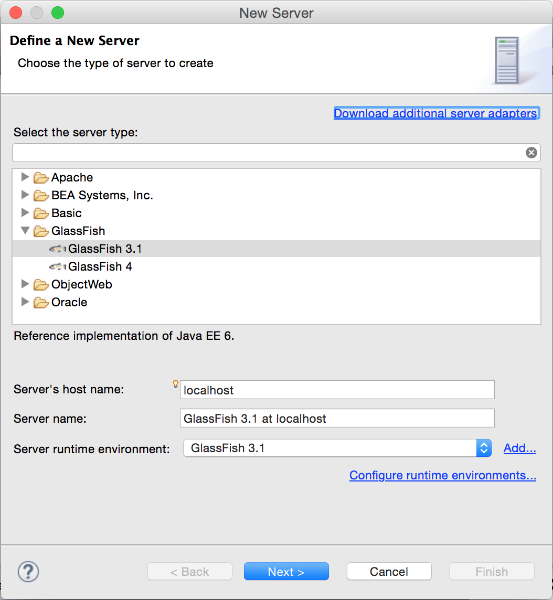
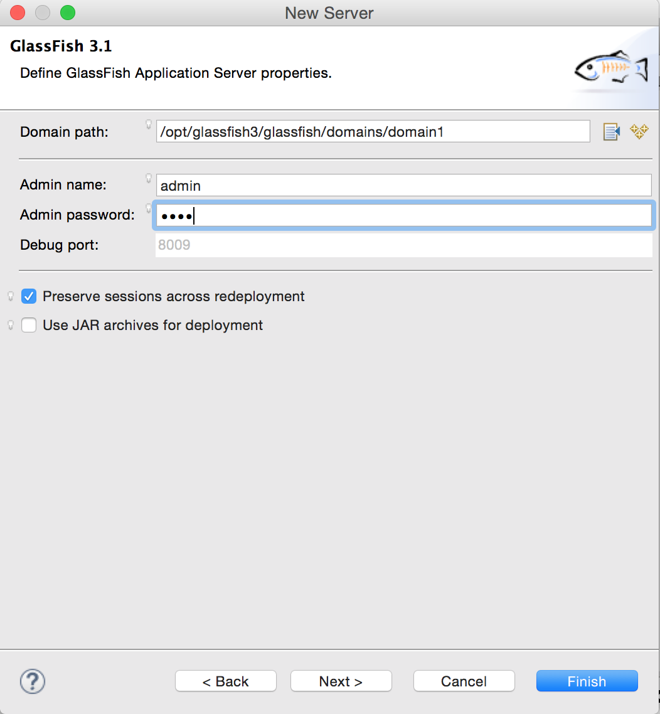
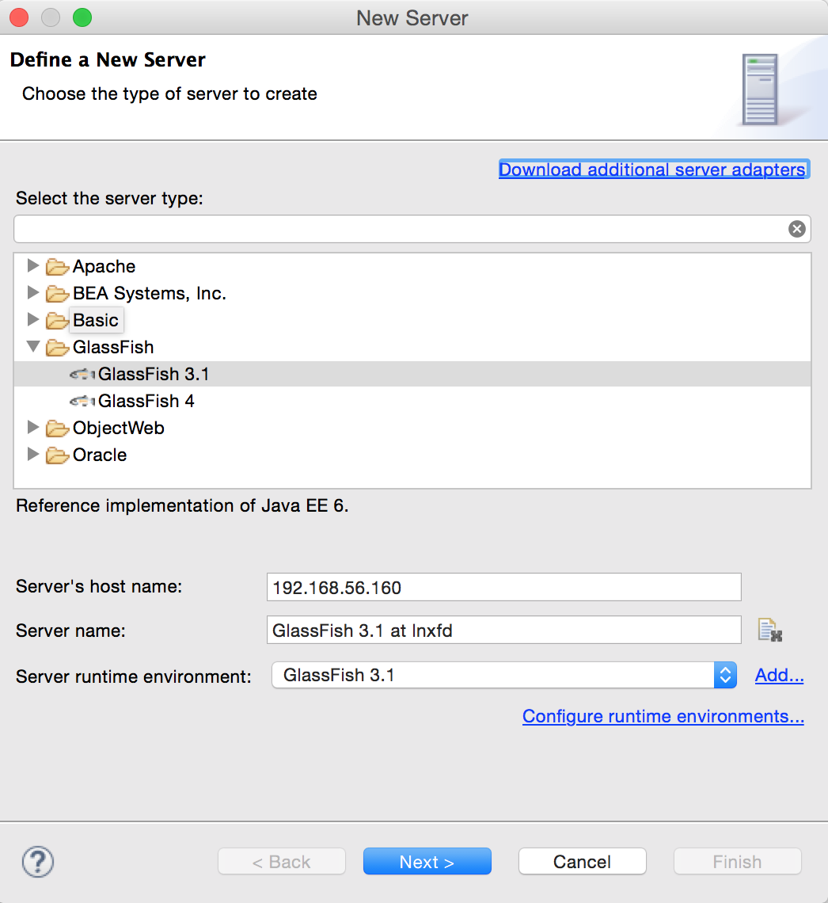

type=post
title=Einbindung von Glassfish in OEPE
date=2017-08-24
category=Entwicklung
tags=ADF, Oracle, Java
~~~~~~
In Eclipse gibt es in der Perspektive Java EE den View Servers über den verschiedene Java EE Server gemanagt werden könne. Auch der Glassfish 3 und Glassfish 4 können darüber lokal und remote verwaltet werden.

<!--more-->

### Hintergrundinformationen
Eigentlich ist die Entwicklung von ADF-Anwendungen hart an Oracles Weblogic-Server gekoppelt. Allerdings
stehen mit den ADF Essentials auch die Basisbibliotheken kostenlos zur Verfügung und können in einen
Java EE-Server deployt werden, der das Full-Profile unterstützt.

Für die Entwicklung mit OEPE bietet sich hier der Glassfish- oder Payara-Server an. Aufgrund der vielen
offenen Bugs in Glassfish 4, sollte Payara in dieser Version der Vorzug gegeben werden. Der zu Java EE 6-kompatible Glassfish 3 funktioniert problemlos mit OEPE 12.1.3.

### Einrichtung der lokalen Glassfish-Installation
Damit ein Glassfish-Server remote verwaltet werden kann, ist zusätzlich immer eine lokale Glassfish-Installation notwendig, da aus der Installation für das Remote-Management der *asadmin* benötigt wird. Eclipse setzt hier nicht wie JDeveloper auf eine eigene Implementierung für die Steuerung und das Management.

Die Einrichtung in diesem Tutorial bezieht sich auf einen Mac und die Einrichtung des Glassfish-Server lokal und in einer virtuellen Maschine. 

Auf dem Mac ist das ZIP-Archiv für den Glassfish-Server in das Verzeichnis `/opt` extrahiert worden, so dass in Eclipse der Server Root `/opt/glassfish3/glassfish` lautet.

### Einbindung in Eclipse
*Tipp:* Eclipse sollte vor der Installation geschlossen sein, denn die Umgebung sucht die Standardpfade nach installierten Runtime-Umgebungen ab, sodass die Einrichtung der Serververbindungen deutlich vereinfacht werden kann.

In Eclipse legt man unter den Servern zunächst den lokalen Glassfish-Server an, damit es später keine Probleme beim Einrichten der Domäne gibt.

Anschließend können die Credentials für den administrativen Login hinterlegt werden:

Die Einstellungen zur Verwaltung eines Remote-Servers unterscheiden sich nicht großartig von denen eines lokalen Glassfish-Servers:

Lediglich die Credentials werden um den Admin-Port erweitert. Über Test Connection kann geprüft werden, ob die Einstellungen korrekt sind und eine Verbindung zum Server hergestellt werden kann.

*Tipp:* Über das Kontextmenü eines Servers können auch die ADF Essentials automatisch deployt werden.

### Weitere Ressourcen
- Auf [GitHub](https://github.com/rollinhand/lgmj-server) existiert ein Projekt von mir, dass einen
[initialen Entwicklungsserver für OEPE](https://github.com/rollinhand/lgmj-server) aufsetzt.

