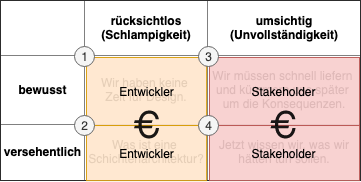

type=post
title=Technische Schulden und wie sie getilgt werden
date=2020-04-04
category=Entwicklung 
tags=Softwareentwicklung,Management
~~~~~~
Im Buch ["Hybride Softwareentwicklung"](https://amzn.to/39oKRQE) gehe ich mit meinen Co-Autoren Philip Knott und
Gregor Sandhaus in Kapitel 4 auf das Thema technische Schulden ein. Es zeigt sich anhand
aktueller Fachartikel und auch in Gesprächen mit Kunden, dass das Thema in der Digitalisierungswelle
einen neuen Stellenwert einnimmt. Zeit sich mit dem Thema etwas ausführlicher auseinander zu setzen.

<!--more-->

Was sind eigentlich technische Schulden und warum sind sie 
negativ konnotiert? Schauen wir zunächst auf die Begrifflichkeit der Schulden.

## Schulden - nur im deutschsprachigen Raum mit negativer Bedeutung

[Wikipedia](https://de.wikipedia.org/wiki/Schulden) beschreibt Schulden als "Verbindlichkeiten, die mit
Rückzahlungsverpflichtungen von natürlichen oder juristischen Personen gegenüber Gläubigern
verbunden sind". Weiterhin heisst es in dem Artikel, dass die negative Konnotation des Begriffs
_Schulden_ mit _Schuld_ nur im deutschsprachigen Raum besteht. So wird im angelsächsischen Raum der
Begriff _debt_ für Schulden und _guilt_ für die Schuld verwendet.

Der Begriff _debt_ ist von dem [lateinischen Verb _debere_](https://www.latein.me/formen/debere) abgeleitet und bedeutet soviel wie
_sollen_ aber auch _schulden_ bzw. _verdanken_ und ist damit deutlich positiver besetzt. Aus diesem
Grund wird auch der Begriff _technical debt_ im englischsprachigen Raum verwendet.

Der Begriff der finanziellen Schuld bedeutet, jemandem Geld zu schulden und damit in der
Pflicht zu stehen, diese Schulden auch zurückzuzahlen. In der Finanzwelt existiert hierfür der
Begriff _Kredit_, der wiederum von dem [lateinischen Wort _credere_](https://www.latein.me/latein/credit) abstammt und soviel
wie _glauben_, _anvertrauen_ und _verleihen_ bedeutet. In der 3. Person Singular ergibt sich das
Wort _credit_, ergo "er verleiht" oder aber auch "er vertraut [mir] an".

[Finanzielle Schuld](https://www.faz.net/aktuell/finanzen/meine-finanzen/finanzieren/wirtschaftswunder-schulden-machen-lohnt-sich-15813983.html) in Form eines Kredits und moralische Schuld hängen eng miteinander zusammen. 
Kommt der Schuldner seiner Verpflichtung zur Rückzahlung der Schulden nicht nach, entsteht neben 
dem rechtlichen Problem auch ein Vertrauensproblem.

Auf diesen Punkt werde ich später noch einmal zurückkommen. Zunächst schauen wir uns den Kontext der
technischen Schulden an.

## Technische Schulden sorgen für den Verfall von Software

[Ward Cunningham](http://wiki.c2.com/?WardExplainsDebtMetaphor) hat die Metapher der technischen Schulden (_technical debt_) in der
Informatik eingeführt, um die Konsequenzen schlechter technischer Umsetzung von Software mit wenigen
Worten beschreiben zu können. Es ist gleichzeitig die Metapher für den zu erbringenden Mehraufwand,
der für die Erweiterung einer bestehden Software notwendig ist.

Es gibt viele Ursachen für die Entstehung von technischen Schulden. Jeder der
professionell Softwareentwicklung betreibt, kennt das Problem vernachlässigter bzw. verfallender
Software. Dazu gehören unter anderem:

* Änderungen und Fehlerkorrekturen werden unüberlegt, unvollständig oder schlampig durchgeführt;
  entweder aus Unwissenheit, Zeitmangel oder der gestiegenen Komplexität der Software.
* Parameter werden hart einkodiert, statt sie flexibel und von außen steuerbar zu gestalten.
* Durch unkontrollierte Weiterentwicklung und Wartung verfällt die ursprünglich geplante Architektur
  bzw. passt nicht mehr zu den sich ändernden Einsatzszenarien.
* Copy & Paste statt Zusammenfassung und Modularisierung. 

Die Liste ließe sich beliebig lang fortsetzen. Kurz gefasst=Der Verfall der Code- und
Architektur-Qualität führt mittel- bis langfristig zu technischen Schulden. 
Nach [Chris Sterling](https://amzn.to/3atDSqH) lassen sich diese Ursachen auf zwei Begriffe zusammenfassen=
_Unvollständigkeit_ und _Schlampigkeit_. 
Aber scheinbar nehmen Kunden, Anwender und Product-Owner die Verschlechterung der Codebasis billigend in Kauf wenn 
dadurch Release-Termine eingehalten werden.

Aber stimmt das wirklich? Nehmen die Interessierten (neudeutsch _Stakeholder_) einer Software
tatsächlich die technischen Schulden billigend in Kauf? Sind sie in der Lage, die langfristigen
Auswirkungen der getroffenen Entscheidungen zu bewerten?

Ein Großteil der heute für eine Anwendung verantwortlichen Personen besitzt nicht das technische
Verständnis, um die Auswirkungen von technischen Schulden bewerten zu können. Tools wie
[Sonarqube](https://www.sonarqube.org) helfen Entwicklern und Verantwortlichen technische Schulden zu identifizieren
und diese in Form eines Schweregrads als auch einer Kennzahl - nämlich dem Aufwand zur Behebung - zu
visualiseren.  

Mit einem solchen Tool lässt sich bedingt die Codequalität bewerten, aber was sagt die
statische Codeanalyse bspw. über die Qualität der Software-Architektur? 

## Von Vertrauen, Krediten und Tilgung bei technischen Schulden

Die Stakeholder einer Software vertrauen in die Entwickler, die ihnen die Anwendung erstellen. Sie
bauen darauf, dass diese die richtigen Entscheidungen treffen. Neben dem finanziellen Vorschuss (sie
finanzieren das Projekt) übertragen sie den Entwicklern auch einen Vertrauensvorschuss.

Dieser "Kredit" hat weitreichende Auswirkungen, denn aus der Praxis weiß jeder Softwareentwickler,
dass sich technische Schulden nicht vermeiden lassen. Wir treffen und unterstützen fast täglich
Entscheidungen von der Benennung einer Methode und seinen Eingangsparametern bis hin zu komplexen
Architekturentscheidungen (Cloud-native, Monolith, Microservices). 

Dabei werden wir Menschen durch den _Bandwagon Effect_ beeinflusst. Der _Mitläufer-Effekt_ oder auch
_Herdentrieb_ ist in der Mikroökonomie bekannt und besagt, dass die Steigerung eines Konsumguts
aufgrund der Tatsache, dass andere Konsumenten dieses Gut gekauft haben, zurückzuführen ist. In der
IT lässt sich dieses Phänomen ebenfalls beobachten="Je häufiger ein Thema in Fachzeitschriften und
[auf] Konferenzen besprochen wird, [desto] stärker scheint der Druck zu wachsen, es auch im eigenen
Unternehmen einsetzen zu müssen." ([Wirdemann, Lueckow; OBJEKTspektrum 06/2019, S.
20](https://webreader.objektspektrum.de/de/profiles/7d30f3fc5f62-objektspektrum/editions/objektspektrum-06-2019))

Entwickler werden folglich extrinsisch beeinflusst und das hat Auswirkungen auf ihre 
Entscheidungen. Denn wer fragt sich nicht, ob er mit seiner Architektur noch am Puls der Zeit ist
oder ob die ausgewählte Programmiersprache, die richtige Lösung für das Problem ist?

Alle Entscheidungen können - nicht müssen - zu technischen Schulden führen. Auf den ersten Blick
sieht es so aus, als obliegt es allein 
den Entwicklern, der Verpflichtung zur "Rückzahlung" nachzukommen und die technischen Schulden 
kontinuierlich zu minimieren bzw. zu "tilgen". Im weiteren Verlauf der Ausführungen zeige ich noch,
dass diese nicht der Fall ist.

Eines der häufigsten Mittel zur Minimierung der
technischen Schulden ist das _kontinuierliche Refactoring_. Hierfür bedarf es auf jeden Fall
_automatisierter Tests_, sodass nach dem Aufräumen und Umbauen sichergestellt ist, dass die
Anwendung bzw. der Code weiterhin korrekt funktioniert.

Hier stellt sich allerdings die Frage, wer für die Aufwände der Refaktorisierung und den damit
einhergehenden Kosten aufkommt? Die Stakeholder einer Software lehnen die Kosten für die
Refaktorisierung einer Software häufig ab, da der Nutzen nicht ersichtlich und aus fachlicher
Sicht keine Wertsteigerung der Software zu erwarten ist.

Kommen wir an dieser Stelle zurück zur Realwirtschaft und den finanziellen Schulden. Ein Begriff aus
der Kreditwirtschaft wurde bislang noch nicht erwähnt=der Zins. Schuldner zahlen dem Gläubiger
Zinsen und sind somit Aufwand. Weiterhin stellt der Zins eine Risikoprämie für die Unsicherheit der
Rückzahlung des Kapitals dar. Je mehr Risiko der Gläubiger eingeht, desto höher fällt der Zins aus,
um einen Anreiz zu schaffen, auf das Kreditgeschäft einzugehen.

## Alternde Systeme und die Beseitigung von technischen Schulden

Kontinuierliche Refaktorisierung beseitigt nicht nur technische Schulden, sondern verlängert auch
die Lebenszeit eines Systems. Und das hat immense Auswirkungen auf zukünftige Kosten. Wird ein
System nicht kontinuierlich angepasst, gibt es am Ende seiner Lebenszeit fünf Wege zur Modernisierung:

* die Beschaffung eines Standardprodukts
* die Entwicklung eines neuen Systems
* die Kapselung des alten Systems
* die Konvertierung des alten Systems und
* die Re-Implementierung des alten Systems

Alle diese Wege sind ebenfalls mit Aufwand versehen. Dieser Aufwand lässt sich über die Laufzeit
eines Systems "abzinsen". Die Frage, die sich Stakeholder bei dem Betrieb eines Systems immer
stellen müssen ist=Wie hoch ist der Aufwand für einen dieser fünf Wege im Gegensatz zur
kontinuierlichen Pflege und technischen Optimierung meines bestehenden Systems.

Das kontinuierliche Refaktorisieren kann dazu dienen die Risikoprämie zu senken. 
Verallgemeinert ist das Risiko die Zukunftssicherheit des Systems und seine mögliche Nutzensteigerung
im Verhältnis zu einer Modernisierung "from scratch". Demnach gilt ebenfalls=Je komplexer das
System mit der Zeit wird, desto höher fällt auch die Risikoprämie aus und somit der Aufwand, der
in das System gesteckt werden muss.

Betrachtet aus einem Gläubiger-Schuldner-Verhältnis bleibt die Frage offen, wer die Aufwände für die
Tilgung und die Zinsen trägt? Ganz so einfach wie in der Kreditwirtschaft lässt sich die Frage im
Kontext der Softwareentwicklung nicht beantworten.

Auftraggeber für die Entwicklung eines Systems lassen sich gerne zu der Aussage hinreissen, dass
*der* Entwickler auch im Vorfeld bereits die _richtige_ Entscheidung hätte treffen können, sodass
keine technischen Schulden entstanden wären.

Die meisten Entscheidungen treffen Menschen unbewusst auf Basis von gesammelten Informationen. Viele
davon laufen routiniert und unbewusst ab. Diese alltäglichen Entscheidungen wie die morgendliche
Routine, den Schutz bei Regenwetter oder den Umgang mit anderen Menschen spulen wir wie
selbstverständlich ab. Dieses Denken in Mustern (Schubladendenken) sorgt dafür, dass wir Menschen wenig Energie für
wiederkehrende Entscheidungen aufwenden müssen. Zeitgleich sorgt dieses Verhalten auch für
[Verzerrungen](https://karrierebibel.de/bias/), die unseren Alltag negativ beeinflussen und uns zu vorschnellen Entscheidungen verleiten
können. Hierzu gehört auch der eingangs beschriebene Mitläufer-Effekt, der zwangsläufig zum
Availability Bias führt.

Aus diesem Grund hat [Martin Fowler](https://martinfowler.com/bliki/TechnicalDebtQuadrant.html) technische Schulden in Quadranten unterteilt und
unterscheidet zwischen Schulden, die bewusst und unwissentlich eingegangen worden sind. Übeträgt man
die Quadranten auf die Aussagen von Chris Sterling, so kann das Modell von Martin Fowler wie in der
ersten Abbildung gezeigt erweitert werden. 

_Abb. 1=Quadrant technische Schulden_

Folglich sind alle rücksichtslosen bzw. schlampigen Entscheidungen -- ob bewusst oder
versehentlich -- keine technischen Schulden im eigentlichen Sinne, sondern fallen unter
handwerkliche Fehler und gehören in die Kategorie Regress oder Gewährleistung. Aus Sicht der Stakeholder
kann auch von Vorsatz gesprochen werden.

Anders verhält es sich mit den Entscheidungen aus der Spalte _umsichtig_.

Enge Release-Termine werden von den Stakeholdern vorgegeben und selten von Entwicklern. Die
Entscheidung ausgelassene Tätigkeiten zu einem späteren Zeitpunkt - nach dem Go-Live - anzugehen
treffen beide Parteien gemeinsam. Allerdings sieht die Realität häufig anders aus und die in die
Zukunft verschobenen Tätigkeiten und Entscheidungen geraten in Vergessenheit. Die daraus
resultierenden technischen Schulden wachsen somit mit Verstreichen der Zeit.

Den Stakeholdern sollte daran gelegen sein, diese Tätigkeiten zeitnah nachzuholen, da neben den
Aufwänden für die Beseitigung der technischen Schulden auch die Risikoprämie zur Erhaltung und
Optimierung der Software steigt. 

Minimal viable products (MVP) bzw. Prototypen minimieren fehlerhafte Design- und
Architekturentscheidungen bzw. dienen zur Erprobung von Programmiersprachen oder Frameworks für den
Lösungseinsatz. Mit diesem Ansatz kann der Mitläufer-Effekt und der damit einhergehende Availability
Bias mitigiert werden. 

Dieses Vorgehen zahlt indirekt auf das Konto zur Vermeidung von technischen Schulden
ein, da im Vorfeld Prävention für Fehlentscheidungen getroffen wird. Der Quadrant vier (umsichtig,
versehentlich) kann somit vom zukünftigen Risiko minimiert werden.

Den Stakeholdern eines Systems sollte an der Risikominimierung gelegen sein, da es sich direkt auf die
zukünftige zu zahlende Risikoprämie für das System auszahlt.

Die Abbildung 2 zeigt zusammenfassend, welche Partei die Beseitigung von technischen Schulden zu
finanzieren hat.

_Abb. 2=Wer die technischen Schulden bezahlt_

## Fazit

Betrachtet man das Thema technische Schulden aus der Brille der Kreditwirtschaft, so kann von
gemeinsam in Kauf genommenen Schulden nur aus der Säule _Unvollständigkeit_ gesprochen werden.
Ausschließlich in diesem Bereich existiert konkludentes Handeln zwischen zwei Parteien bei denen das
Vertrauensverhältnis nicht verletzt wird. 

Im ersten Fall wird ein Risiko in Kauf genommen, um der Komponente Zeit Rechnung zu tragen. Beide
Parteien müssen sich sowohl auf das Vorgehen als auch die mitigierenden Maßnahmen verständigen. Der
Stakeholder des Systems sollte dabei sowohl die Aufwände für die Beseitigung der technischen
Schulden als auch die Erhöhung seiner Risikoprämie (Zukunftsfähigkeit des Systems) im Auge behalten.

Um nicht in den Umstand zu laufen, versehentlich eine architektonische Fehlentscheidung getroffen zu haben, die sich
erst spät in der Zukunft auswirkt, existiert das Konzept des MVP. Es dient ebenfalls als
mitigierende Maßnahme und ist insbesondere in iterativen Entwicklungsmethoden ein willkommener
Ansatz zur Verprobung neuer Technologien.

Als dritter Ansatz zur Reduktion von technischen Schulden als auch zur Reduktion der Risikoprämie, ist das
kontinuierliche Refactoring eines Systems zu berücksichtigen. Durch kontinuierliche, technische
Optimierungen, die keinen fachlichen Nutzen bringen, sichern die Stakeholder die Zukunftsfähigkeit
des Systems und reduzieren die Risikoprämie, die sich aus den abgezinsten Kosten einer Modernisierung des kompletten
Systems in der Zukunft ergeben würde.