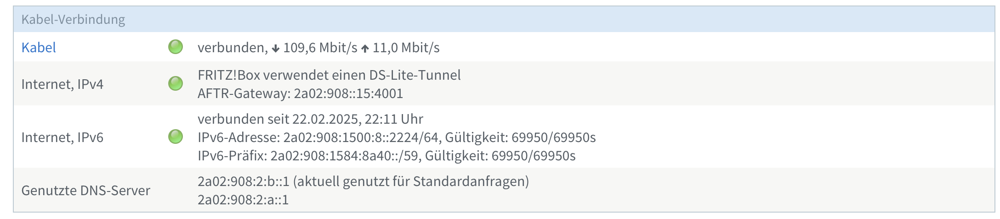
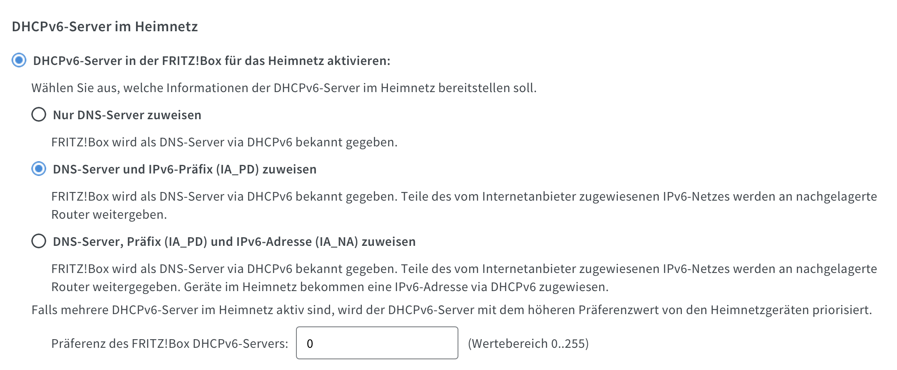
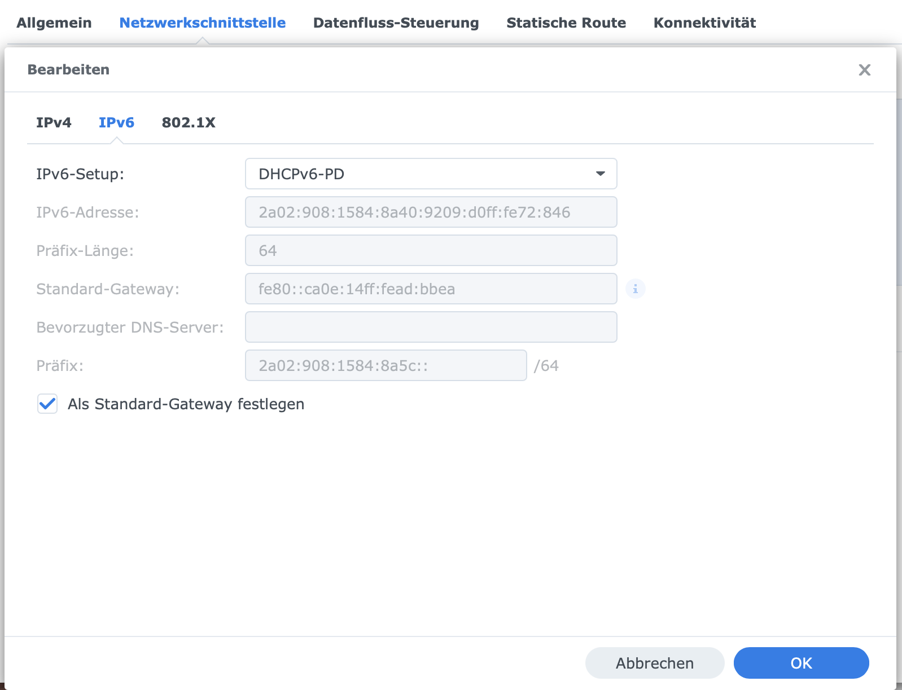
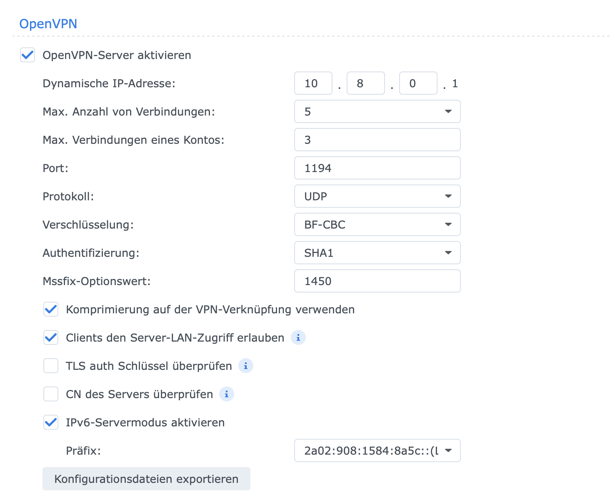
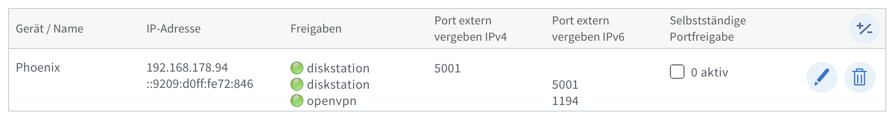
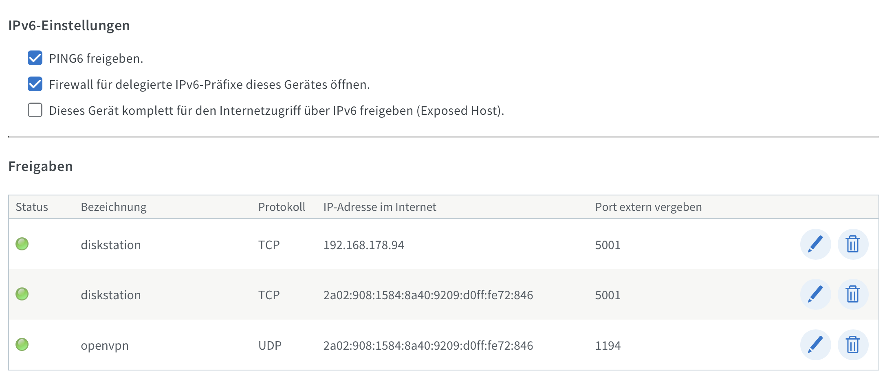

type=post
title=VPN-Zugang mit DS-Lite und älterer Fritz!Box 6490 über OpenVPN
date=2024-02-28
category=Technologie
tags=OpenVPN,DS-Lite,Fritz!Box
~~~~~~

In vielen Haushalten wird der Kabelanschluss über Dual-Stack Lite (DS-Lite) bereitgestellt, was bedeutet, dass der Internetzugang über IPv6 erfolgt, während IPv4-Verbindungen über einen Carrier-Grade NAT (CGN) umgeleitet werden. Dies kann bei der Einrichtung von VPN-Verbindungen zu Problemen führen, da viele VPN-Lösungen traditionell auf IPv4 basieren. Bei älteren Routern wie der Fritz!Box 6490, die möglicherweise nicht die neuesten VPN-Protokolle wie WireGuard unterstützen, bietet OpenVPN eine praktikable Alternative, um auch über IPv6 eine sichere VPN-Verbindung herzustellen.

<!--more-->

## Schnellanleitung

Hier sind die wichtigsten Schritte, um OpenVPN mit deiner Fritz!Box 6490 und DS-Lite zu nutzen:

1. IPv6 aktivieren: Stelle sicher, dass die IPv6-Unterstützung in deiner Fritz!Box eingeschaltet ist.
2. OpenVPN auf einem NAS installieren: Nutze z.B. eine Synology DiskStation als VPN-Server. Alternativ funktioniert auch ein Raspberry PI hervorragend.
3. DHCPv6-PD aktivieren: Lasse die DiskStation IPv6-Subnetze von der Fritz!Box beziehen.
4. Portfreigabe für OpenVPN: Freigeben des UDP-Port 1194 auf der Fritz!Box.
5. MyFritz einrichten: Nutze MyFritz für eine dynamische DNS-Adresse.
6. IPv6-Servermodus aktivieren: Konfiguriere OpenVPN für IPv6-Verbindungen.

Das war zu schnell, dann kommt hier die ausführliche Anleitung mit Bildern.

##Ausführliche Anleitung

### Schritt 1: IPv6-Konfiguration auf der Fritz!Box

Um OpenVPN über IPv6 nutzen zu können, musst du sicherstellen, dass die IPv6-Unterstützung in deiner Fritz!Box aktiviert ist. Hier sind die Schritte:

* Zugang zur Fritz!Box-Web-Oberfläche: Öffne einen Webbrowser und gehe zu `http://fritz.box` oder der IP-Adresse deiner Fritz!Box.
* IPv6-Einstellungen: Navigiere zu Internet > Online-Monitor und stelle sicher, dass IPv6 aktiviert ist.
* IPv6-Subnetze vergeben: Gehe zu Heimnetz > Netzwerk > Netzwerkeinstellungen > IPv6-Einstellungen und stelle sicher, dass die Fritz!Box IPv6-Subnetze an nachgelagerte Geräte verteilt.


_Im Online-Monitor kann auf einen Blick erfasst werden, ob IPv4 und IPv6 aktiv sind._


_IPv6 Subnetze und Präfixe werden an nachgelagerte Geräte weitergegeben._

### Schritt 2: OpenVPN auf einem nachgelagerten Server einrichten

Installiere OpenVPN auf einem nachgelagerten Server wie einer Synology DiskStation oder einem Raspberry PI. Ich gehe in diesem Beitrag nur auf die Synology DiskStation ein.

* OpenVPN-Paket installieren: Öffne die Paketverwaltung auf deiner Synology DiskStation und installiere das VPN-Server-Paket.
* DHCPv6-PD aktivieren: Stelle sicher, dass die DiskStation DHCPv6-PD nutzt, um IPv6-Subnetze von der Fritz!Box zu beziehen. Dies kannst du in den Netzwerkeinstellungen der DiskStation konfigurieren.


_DHCPv6-PD-Einstellungen der Synology DiskStation_

### Schritt 3: OpenVPN-Konfiguration abschließen

Aktiviere im OpenVPN-Setup auf der DiskStation den IPv6-Servermodus:

* IPv6-Servermodus aktivieren: Öffne die OpenVPN-Konfiguration auf deiner DiskStation und aktiviere den IPv6-Servermodus, um IPv6-Verbindungen im VPN-Tunnel zu ermöglichen.
* Client-Konfiguration erstellen: Die Konfigurationsdatei für OpenVPN kann exportiert werden und muss anschließend angepasst werden. Die Variable für den Server in der Konfiguration ersetzen wir durch den MyFritz!Account den wir im nächsten Schritt erstellen werden.


_Exemplarische Einstellungen für OpenVPN_

### Schritt 4: Ports freigeben und MyFritz einrichten

Um OpenVPN-Verbindungen zuzulassen, musst du den UDP-Port 1194 auf der Fritz!Box freigeben:

* MyFritz einrichten: Nutze den MyFritz-Dienst, um eine dynamische DNS-Adresse für deine DiskStation zu erhalten. Dies erleichtert den Zugriff auf den VPN-Server von außerhalb des Heimnetzes.
* Portfreigabe: Gehe in der Fritz!Box-Oberfläche zu Internet > Freigaben und erstelle eine neue Portfreigabe für den UDP-Port 1194 und 5001 (Synology Frontend) und nutze die MyFritz!Freigabe.



_Übersicht der notwendigen Ports in der Portfreigabe_


_Portfreigaben für IPv4/IPv6 für das Synology Frontend, OpenVPN nur über IPv6_

### Auszug OpenVPN-Konfiguration

In der OpenVPN-Konfiguration muss das Protokoll auf udp6 gesetzt werden und der Server auf den Servernamen der MyFritz!Freigabe gesetzt werden.

```
remote gerät.randomString.myfritz.net 1194

redirect-gateway def1

proto udp6
```


## Fazit

Trotz der Einschränkungen von DS-Lite und älteren Routern wie der Fritz!Box 6490 kann OpenVPN eine zuverlässige Lösung für den VPN-Zugang bieten. Durch die Nutzung von IPv6 und die Einrichtung eines nachgelagerten VPN-Servers kannst du sicherstellen, dass deine Verbindungen auch in Umgebungen mit DS-Lite stabil und sicher bleiben. Mit dieser Anleitung kannst du deine Synology DiskStation als VPN-Server nutzen und von überall auf deine Heimnetz-Dienste zugreifen.

**Quellen:**

[Thomas Schäfer: OpenVPN aus Synology NAS mit MyFritz-Freigabe von Fritzbox](https://www.thomas--schaefer.de/openvpn%20synology%20nas%20myfritz.html)


